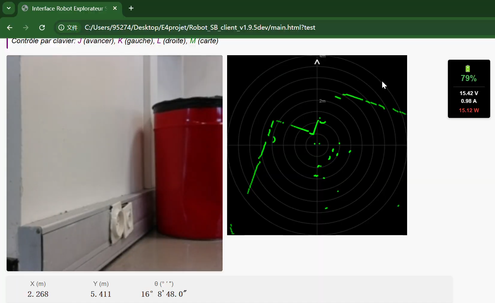
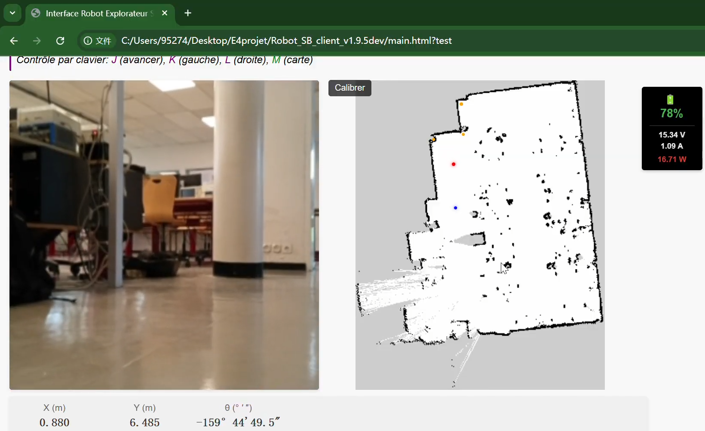

# CleanRoom Robot Teleoperation System
# 无尘室远程监控与混合导航机器人

Based on **Turtlebot4** and **ROS2**, this system provides a low-latency web interface for remote monitoring and hybrid navigation control in clean room environments.
基于 Turtlebot4 与 ROS2 的远程巡检系统，实现了低延迟的 Web 端监控与手动/半自动/自动混合导航控制。

## Project Structure 目录结构

```text
├── web_frontend/      # Web visualization interface
├── ros2_scripts/      # Custom ROS2 nodes
└── docs/              # Documentation & Screenshots
```

## Key Features 核心功能

1.  **Real-time Visualization**: High-performance rendering of Lidar point clouds and camera streams via HTML5 Canvas.
2.  **Hybrid Navigation**: Seamless switching between Manual (Keyboard), Semi-Auto (Click-to-Move), and Auto Patrol modes.
3.  **Coordinate Calibration**: Implemented Affine Transformation to map the robot's physical coordinates to the frontend static map.
4.  **Simplified Control**: Encapsulated complex ROS2 Actions into simple Service Triggers for one-click operations.

## Dashboard Preview 控制面板预览

### 1. Lidar Visualization & Real-time Monitoring
**激光雷达可视化与实时监控**：
Displaying real-time camera stream and high-frequency Lidar point cloud rendered via HTML5 Canvas. The green points represent obstacles detected by the sensor.
<br>


<br>

### 2. Map Calibration & Navigation
**地图校准与导航模式**：
Real-time localization overlay on the static facility map. The coordinate mapping is achieved through **Affine Transformation** based on the calibration points (orange/red/blue dots).
<br>
